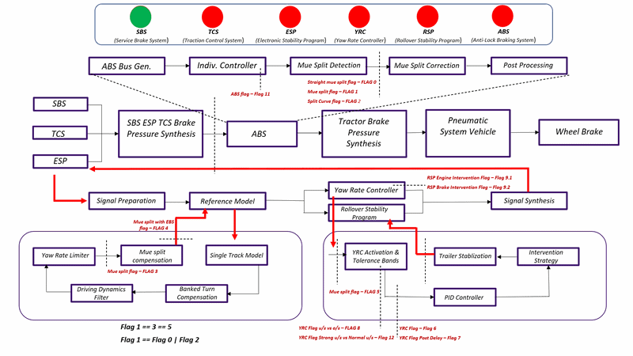
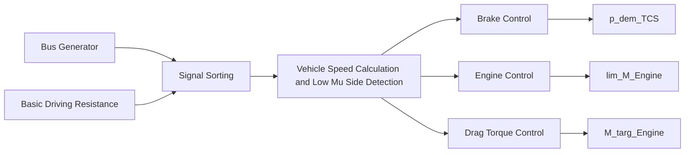
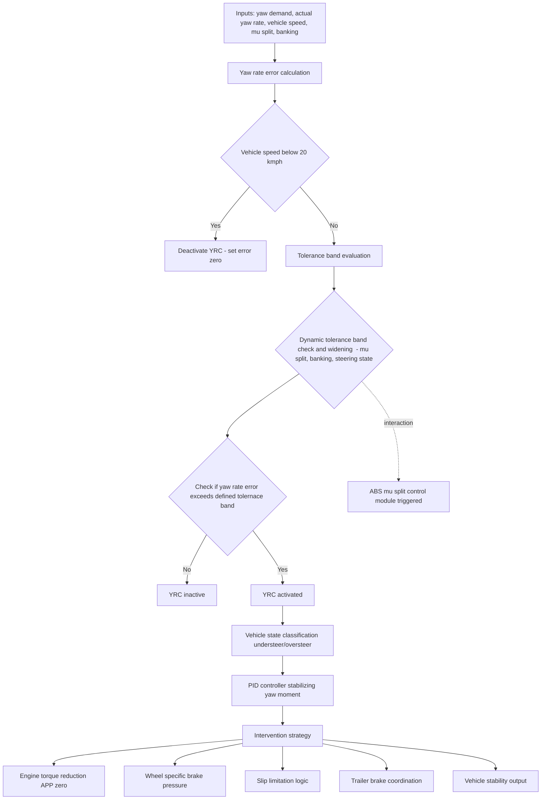
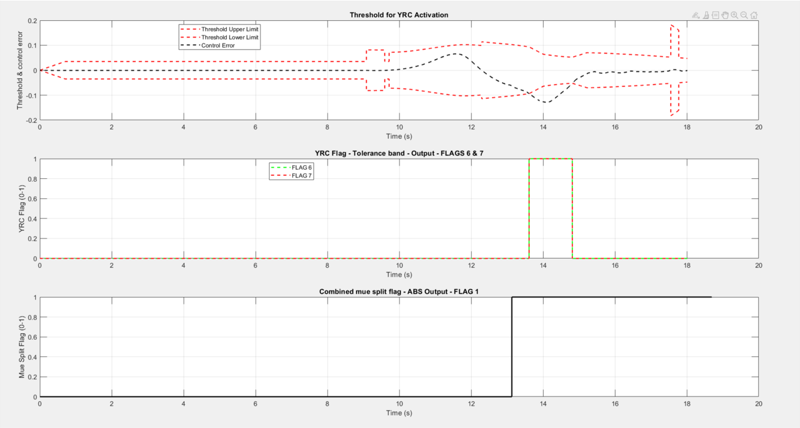
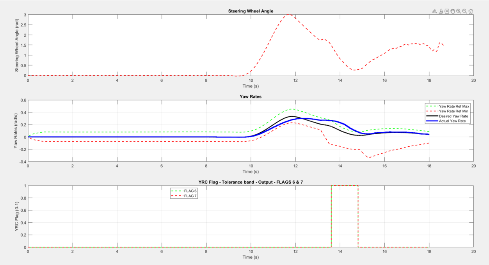
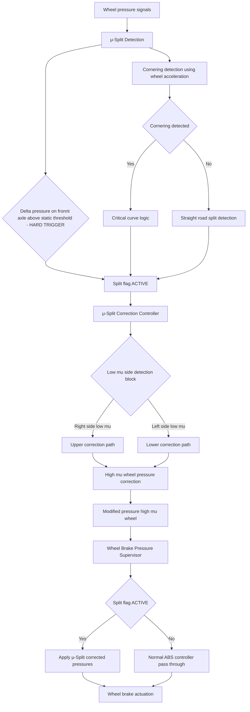

# DAS-Development-Validation-Verification

⭐ **1. Introduction**

Modern commercial vehicles are equipped with a wide range of Driver Assistance Systems (DAS) designed to improve vehicle safety, stability, and operational efficiency. Advances in Model-Based Development (MBD) and vehicle dynamics simulation enable these systems to be developed, calibrated, and validated in virtual environments across a broad spectrum of real-world driving scenarios before deployment to production hardware.

This project focuses on the development of multiple DAS functionalities within the Electronic Braking System (EBS) architecture of commercial vehicles using MATLAB/Simulink. In addition, an automated Verification & Validation (V&V) framework is implemented to execute simulation-based test campaigns, evaluate system performance, and generate validation reports through co-simulation workflows.

<table>
  <tr>
    <td align="center">
      <b></b> 
      
    </td>
  </tr>
</table>

---

🔒 **2. Project Availability & Confidentiality**

This project was developed in collaboration with a leading German commercial vehicle OEM. Due to confidentiality agreements and the proprietary nature of the MATLAB/Simulink and IPG TruckMaker models, the original implementation, simulation assets, calibration data and test environments cannot be publicly shared.

To demonstrate the technical scope of the work, this repository provides system architecture diagrams, workflow illustrations, pseudo-codes  , validation methodologies, and conceptual dashboards that mirror the development and testing process. The objective is to showcase practical experience in Systems Engineering, Model-Based Development (MBD), co-simulation, and automated V&V workflows while fully respecting intellectual property and confidentiality requirements.

---

⚙️ **3. Service Brake System (SBS)**

**Input**
- Driver deceleration demand  
- Vehicle configuration parameters  

**Output**
- Brake pressure demand per wheel 

**Function**  
Computes required braking performance by translating driver deceleration demand into brake force level (BFL) and brake force distribution (BFD), including trailer braking coordination. Generates wheel-level brake pressure requests for downstream EBS actuation.

---

⚙️ **4. Traction Control System (TCS)**

The TCS is structured into three core control functions within the vehicle dynamics control architecture: Engine Control, Brake Control, and Drag Torque Control.

**Input**
- Driven and non-driven wheel speeds  
- Vehicle speed and acceleration state  
- Road friction estimate (μ / “mu”)  
- Differential lock status  
- Gear shift / driveline state  

**Output**
- Engine torque reduction request  
- Individual wheel brake pressure (selective braking)  
- Engine torque increase request (drag torque compensation)  

**Function**  
Prevents wheel slip and instability during low-μ or split-μ driving conditions by coordinating engine torque and brake interventions. Compares wheel speed differentials across axles to detect slip, then applies engine torque limitation, selective wheel braking (active up to ~40 km/h), or drag torque compensation during downshifts to maintain traction and vehicle stability.

A simplified architecture diagram of the TCS implementation is shown below.

---

⚙️ **5. Electronic Stability Program (ESP) - Pre YRC Deployment**

**Input**
- ESP sensor signals (wheel speeds, brake pressures, yaw rate, longitudinal acceleration, gear ratio)  
- Ideal reference signals from TruckMaker (friction coefficient, trailer articulation angle)  
- Vehicle geometry parameters  

**Output**
- Desired yaw rate of the driver corrected for road banking, filtered for noise and milied by road friction coefficient. 

**Function**   
Prepares and structures all vehicle, sensor, and simulation inputs into dedicated signal buses for stability control. A reference model computes driver-desired yaw rate using a single-track vehicle model, followed by bank compensation, signal filtering (DD filter), and μ-limited yaw rate constraint. The resulting corrected yaw reference is used as the input for downstream Yaw Control (YRC) and Roll Stability Program (RSP) functions.

---

⚙️ **7. Yaw Rate Controller (YRC)**

The Yaw Rate Controller (YRC) is a vehicle stability function that detects deviations between driver-demanded and actual yaw behavior and intervenes through engine torque reduction, selective braking, and slip control. Its activation is governed by dynamic tolerance bands that account for vehicle speed, μ-split conditions, and road banking to ensure stable yet non-intrusive control intervention.

A simplified architecture view of the developed Yaw Rate Controller (YRC) is shown below, illustrating its activation logic, state classification, and intervention strategy based on driver yaw demand and vehicle dynamic feedback.

NOTE: The tolerance band defines the allowable deviation between desired and actual yaw rate within which no intervention is triggered; it is dynamically adjusted based on vehicle speed, μ-split conditions, road banking, and steering state.

The plots show how the YRC is activated when the control threshold exceeds the tolerance band. Once enabled, the YRC reduces the deviation between the desired and actual yaw rate. It is deactivated when the error returns within the defined limits.

<table>
  <tr>
    <td align="center">
      <b>YRC Activation / Trigger</b> 
      
    </td>
  </tr>

  <tr>
    <td align="center">
      <b>YRC in Action</b> 
      
    </td>
  </tr>
</table>

---

⚙️ **6. Rollover Stability Program (RSP)**

**Input**
- Measured lateral acceleration (from sensors and reference model)
- Steering-wheel-based theoretical lateral acceleration
- Vehicle geometry and CG height
- Critical rollover threshold (static + dynamic)
- Vehicle state signals (yaw rate, speed)

**Output**
- Engine torque reduction request (via APP override)
- Global brake pressure demand (all wheels)
- Target deceleration request
- Wheel slip targets

**Function**
Estimates rollover risk by comparing effective lateral acceleration against a critical tipping threshold derived from vehicle dynamics and load conditions. The ratio is used to generate a graded rollover risk index (0–1), which triggers progressive intervention from pre-emptive torque reduction to full braking via the EBS interface. The system applies coordinated braking across all axles to stabilize the vehicle before rollover occurs.

---

⚙️ **7. Anti-Lock Braking System (ABS)**
The ABS μ-Split architecture is designed to detect and mitigate braking instability caused by differing road friction levels between the left and right sides of the vehicle. It combines pressure-based split detection with cornering state estimation to reliably distinguish true μ-split conditions from normal curved-road braking, and then applies a structured correction strategy through selective brake pressure arbitration and wheel-level actuation.

μ-Split Detection & Control - Architecture overview 

---
🧪 **8. Verification & Validation (V&V) Framework**

This project includes an automated Verification & Validation (V&V) framework for Driver Assistance Systems (DAS) developed within a MATLAB/Simulink and IPG TruckMaker co-simulation environment. The framework enables scenario-based validation of control functions under a wide range of driving and road conditions.

A configurable MATLAB-based interface allows users to select test vehicles, define simulation scenarios, and tune controller parameters. The same test case can be executed for a single vehicle setup or used for comparative evaluation between two configurations.

More than 150 test scenarios are executed in batch mode, covering diverse operational conditions including varying friction levels, road geometries, and driving maneuvers. Key performance metrics such as vehicle stability, yaw response, braking performance, and trajectory tracking are computed automatically, along with visualization of vehicle paths and system responses.

The entire test suite is executed in an automated workflow, generating structured simulation outputs and a consolidated validation report. On average, a full batch simulation requires approximately 8 hours on a high-performance multi-core simulation workstation running MATLAB–TruckMaker co-simulation.

---

🧭 **9. Test Scenario Library**

The V&V framework includes a structured set of standardized driving maneuvers designed to evaluate ABS and ESP performance under diverse friction and dynamic conditions. These scenarios are executed in batch mode within the MATLAB–TruckMaker co-simulation environment. Some example scenarios are listed below.

🛑 ABS Test Scenarios
- ABS braking on straight road with split-μ (left side or roght side low friction)
- ABS braking in left curve (100 m radius) with split-μ (left side or right side low friction)
- ABS braking on downhill gradient with split-μ conditions
- ABS braking on low-μ chessboard surface

🚗 ESP Test Scenarios
- Constant-radius circular driving on split-μ surface (45 m radius)
- J-turn maneuver with induced oversteer conditions (vehicle stability limits)

Many more custom maneuevers were created for V&V of all controls developed/ optized/ debugged as part of this project. In total this adds upto 150+ unique maneuvers. 

---

📊 **10. Project Outcomes - Key Numbers**

🚗 **7** – Number of driver assistance systems modelled, validated, and verified  
⚙️ **2** – Number of automated workflows developed for validation and verification  
🛣️ **150+** – Individual driving maneuvers developed for testing  
📉 **70% – 75%** – Average reduction in end-to-end V&V time through automation  

---

👨‍💻 **11. Skills Demonstrated**

Through this project I demonstrate my ability to

- Develop, optimize, and debug full-vehicle models in MATLAB/Simulink and Stateflow for system-level validation.  
- Execute MATLAB–IPG TruckMaker co-simulations for end-to-end vehicle dynamics and ADAS verification.  
- Design MATLAB GUIs and automation scripts to streamline V&V workflows and accelerate reporting.  
- Buils standardized, reusable test scenarios for structured V&V process of automotive subsystems.  
